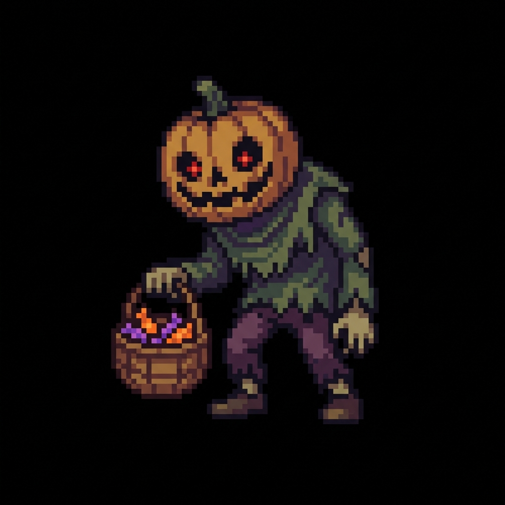

# 都市斩杀线 (CITY OF SEVERANCE) - 多端开发版本



本项目正在从原生 Web (Three.js) 平台向 Unity 2D 平台进行迁移，以获得更好的视觉表现力和开发效率。

## 📂 项目结构

```text
killLine/
├── web-js/                 # 原 Web 版 (Three.js)
│   ├── index.html          # 游戏入口
│   ├── assets/             # 资源文化
│   └── src/                # JavaScript 源码
├── unity/                  # 正在开发的 Unity 2D 版本
│   ├── Assets/             # Unity 资源目录
│   │   ├── Scripts/        # C# 核心逻辑 (已移植)
│   │   ├── Sprites/        # 精灵图资源 (已同步)
│   │   └── ...
│   └── UnityMigrationGuide.md # Unity 迁移与配置指南
└── README.md               # 本项目总体说明
```

## 🚀 迁移状态

- [x] **目录整理**：完成 `web-js` 与 `unity` 的文件夹分级。
- [x] **资源同步**：所有像素素材已同步至 `unity/Assets/Sprites`。
- [x] **逻辑移植**：
    - `PlayerManager` (玩家属性与背包) -> 已移植为 C#
    - `EventManager` (事件触发系统) -> 已移植为 C#，并适配 ScriptableObject
    - `WorldScroller` (无限环境滚动) -> 已移植为 C#
    - `GameManager` (核心循环维护) -> 已移植为 C#
- [ ] **Unity 组装**：目前已提供所有核心代码，需在 Unity 编辑器中进行界面搭建。

## 🕹️ 如何开始

### Web 版本 (稳定版)
进入 `web-js` 文件夹，在浏览器中打开 `index.html` 即可直接游玩。

### Unity 版本 (开发中)
1. 在 `unity` 文件夹下新建 Unity 2D 项目。
2. 参考 [Unity 迁移与配置指南](unity/UnityMigrationGuide.md) 进行场景与脚本挂载。

---
